# Recepie Radar

## Description

Welcome to Recipe Finder! This project is a responsive web and mobile application that allows authenticated users to search for food recipes. The application integrates the Edamam API to fetch recipe data based on user queries. Users can explore a variety of recipes, view detailed information about each recipe, and enjoy a seamless user experience across web and mobile platforms.

## Language : React 

## Project Links

- GitHub: [Recepie Radar -Web Version (React)](https://github.com/codeopstrek/Recipe-Radar)

- GitHub: [Recepie Radar -App Version (React Native)](https://github.com/saurabhkumarr99/Culinary-Finder-App)

- Live: [Recepie Radar -Web Version (React)](https://codeopstrek.github.io/Recipe-Radar-Deploy/)


- Live Expo Go QR code: Scan the following QR code with an Android device to open it in Expo Go.

<p align="center">
  
</p>

## Table of Contents

- [Features](#features)
- [Getting Started](#getting-started)
- [Usage](#usage)
- [Components Structure](#components-structure)
- [Screenshots](#screenshots)
- [Author](#author)

## Features


- **User Authentication:** Allow users to register, log in, and log out securely.
- **Recipe Search:** Enable users to search for recipes based on various criteria, such as ingredients, cuisine type, and dietary restrictions.
- **Recipe Details:** Display comprehensive information about each recipe, including ingredients, nutritional facts, and cooking instructions.
- **Responsive Design:** Ensure the application is fully responsive and functional on both web and mobile devices.
- **User Dashboard:** Provide users with a personalized dashboard to view their search history and favorite recipes.
- **Data Refresh:** Implement functionality to refresh recipe data periodically or on user request.
- **Mobile-Specific Features:** Utilize mobile-specific features and gestures to enhance the user experience in the mobile app.

## Getting Started

### Prerequisites

- Node.js and npm (Node Package Manager) installed on your computer.
- Node.js: [Download and Install Node.js](https://nodejs.org/)

Follow these steps to run the Blog App locally:

1. **Unzip the Recepie Radar App:**

2. **Navigate to the project directory:**

   ```bash
   cd RecepieRadar
   ``` 

2. **Install Dependencies:**

   ```bash
   npm install
   ``` 


3. **Run:**

 - `Start Project`
   ```bash
      npm start
   ``` 

 - `Test Project`
   ```bash
      npm test
   ``` 

 - `Test Coverage`
   ```bash
      npm run coverage
   ``` 

- `Selenium Testing`

   ```bash
     node ./src/TestFilesSKR/SeleniumTestSKR/LoginSKRTest 
   ``` 


## Usage

- **Search for Recipes**: Use the search feature to find recipes based on ingredients, cuisine type, dietary restrictions, and more.
- **View Recipe Details**: Click on a recipe card to view detailed information including ingredients, nutritional facts, and cooking instructions.
- **Save Favorite Recipes**: Save your favorite recipes to access them later from the user dashboard.

## Code Structure

The project follows a structured directory layout for better organization:

- **allComponentsskr/**
- **ScreenShots/**
- **App.js**
- **README.md**

## Screenshots

### Web (React)

<p align="center">
   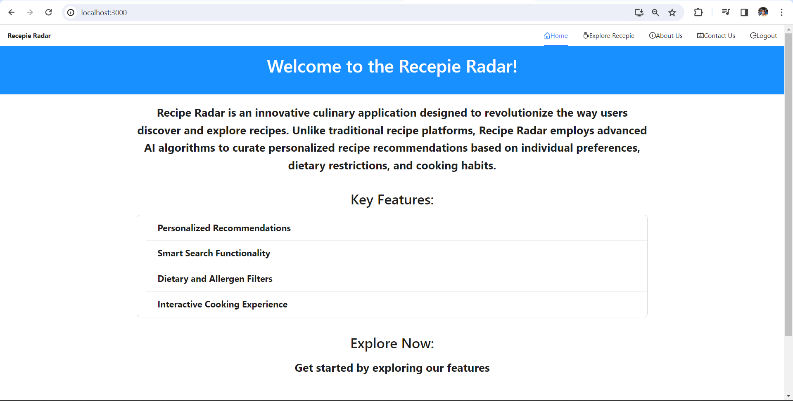
   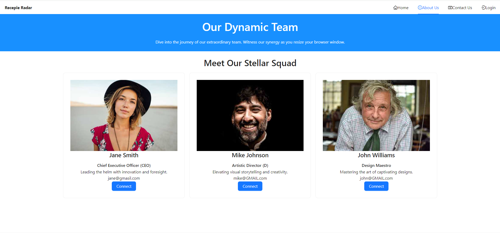
   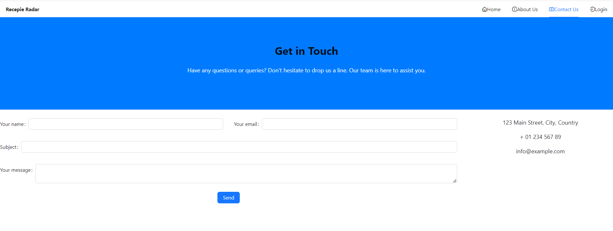
   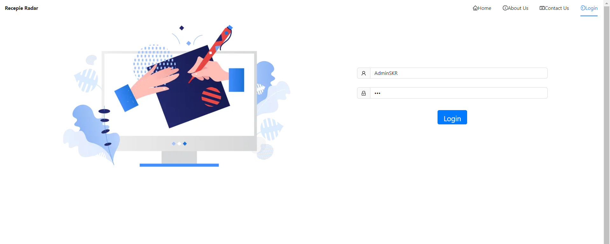
   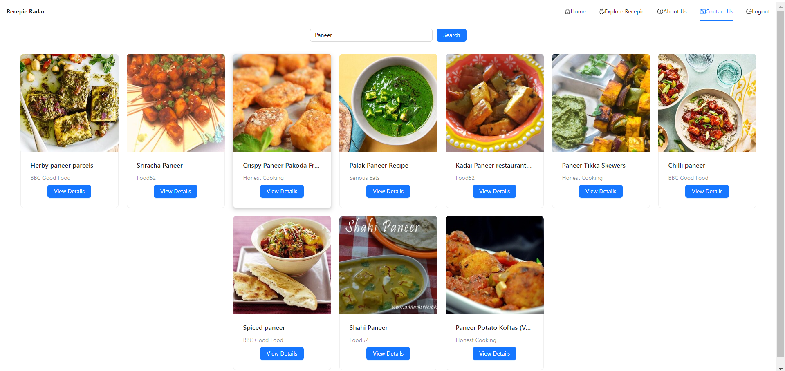
   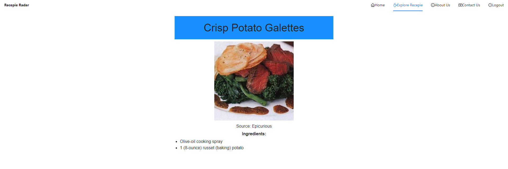
  
</p>

### Web (React Native)

<p align="center">
   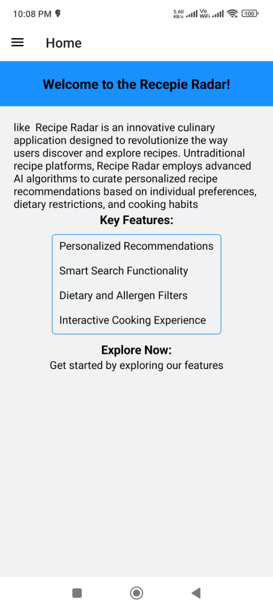
   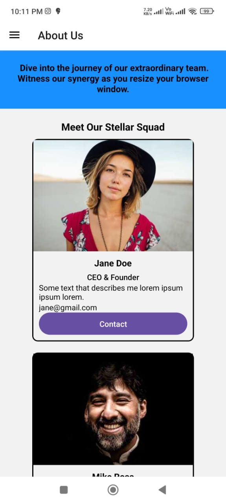
   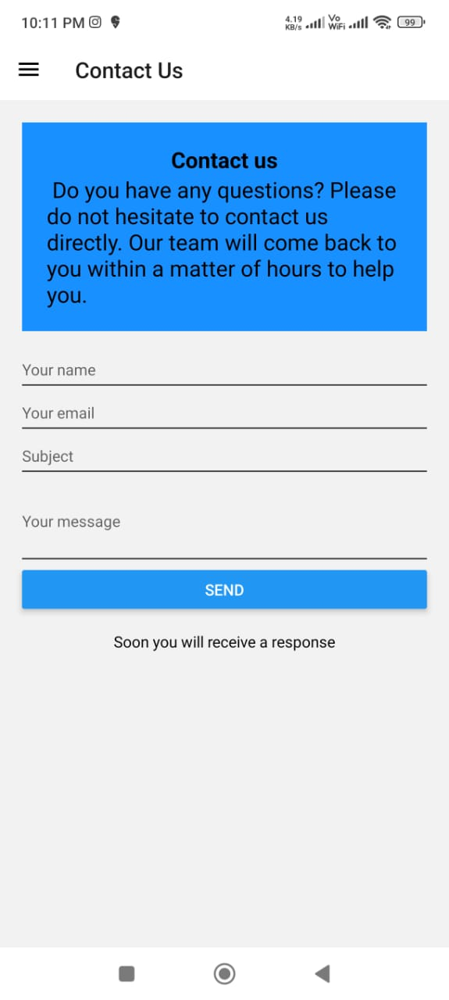
   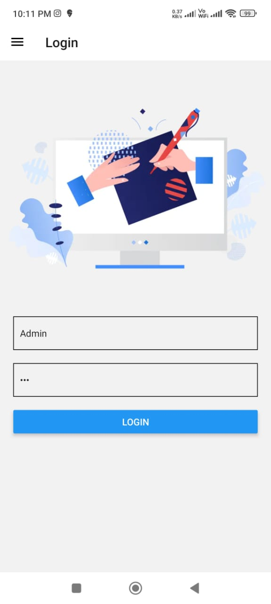
   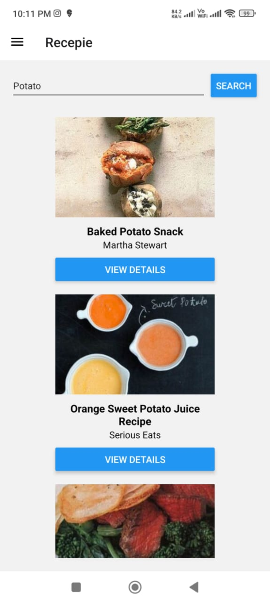
   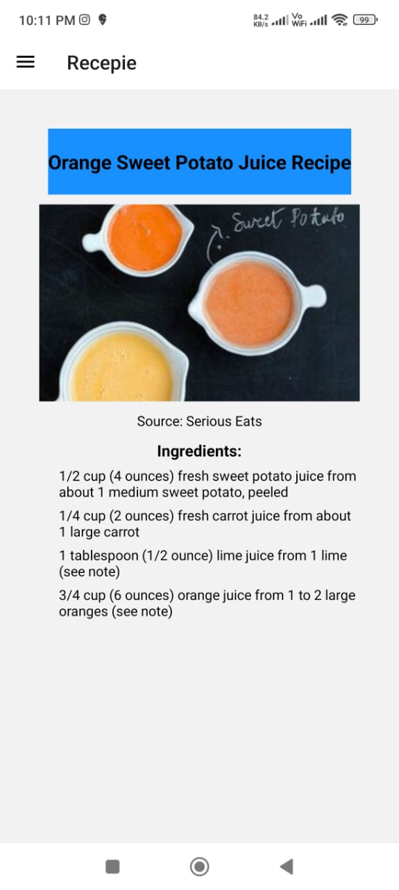
  
</p>

- `Unit Test`
<p align="center">
  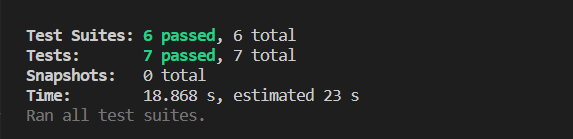
</p

- `Coverage Test`
<p align="center">
  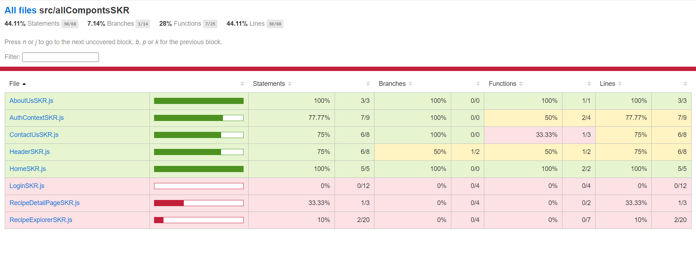
  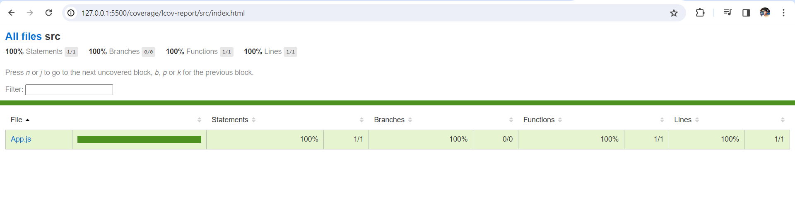
</p


## Author

- SAURABH KUMAR RAI

